# Ферма

Self-hosted сервис для развертывания приложений из пулл-реквестов.

# Как это работает?

**CI**

- Создайте Pull Request
- Отправьте веб-хук в FarmAPI для создания нового инстанса

**Farm**

- Скачает код
- Выполнит сборку
- Запустит инстанс

**CI**

- Запросите из FarmAPI текущий статус инстанса
- Получите URL инстанса, когда он будет готов
- Используйте собранный инстанс для запуска E2E-тестов

Общая схема доступа к ресурсам.
Итоговый вариант может быть чуть сложнее, зависит от выбранной конфигурации.

## Провайдеры

Ферма поддерживает следующие провайдеры:

- Docker
- k8s

От выбранного провайдера зависит сложность инфраструктуры и возможности масштабирования.

**Docker**

При использовании docker-провайдера ферма сможет работать только на одной виртуальной машине. Балансировщик, сервис фермы и собранные инстансы будут использовать ресурсы одной виртуальной машины.

Это экономичный и простой вариант для небольших команд.

Рекомендуется ограничить количество параллельных сборок или выполнять не более одной сборки одновременно.

Текущие ограничения:
- Частичная поддержка BuildKit (некоторые функции могут не работать)
- Не поддерживаются функции монтирования файлов и каталогов (включая секреты и аналогичные функции)

**k8s**

При использовании k8s компоненты фермы, включая инстансы и процессы их сборки, запускаются независимо друг от друга. В таком варианте ферма сможет масштабироваться горизонтально.

# Начало работы

Рекомендуем начать с разворачивания одной из тестовых конфигураций фермы, а после настроить ферму для своих проектов.

